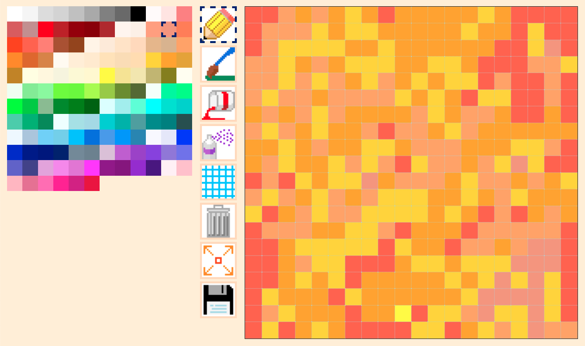

# Pixelarter

## About The Project

Pixelarter is a simple pixel art editor remeniscent of the early days of Microsoft Paint. 

## Built With

Pixelarter is built primarily in vanilla javascript, HTML, and CSS. Artwork is created in a basic grid of divs manipulated using CSS. 'Downloading' the image compiles it into a 2D array and passes it to the Django backend which then uses the Python Image Library (Pillow) to create a .png file.

* javascript, HTML, CSS
* Django
* Python
* Pillow
* Numpy

<!-- USAGE EXAMPLES -->
## Usage

Click tools and colours to select them. Using the Draw, Paint, or Spray tool, click and drag across the canvas while holding down the mouse button and release to to stop drawing. Using the Fill tool, click any square to paint it and any adjacent squares of the same colour.

[Watch demo](https://youtu.be/s54NOhReqa0)

